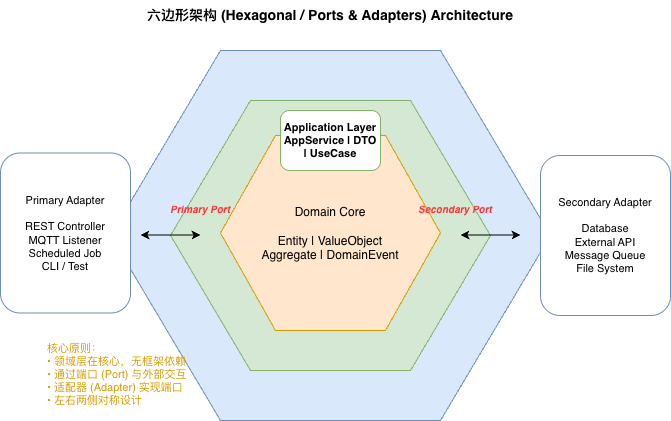
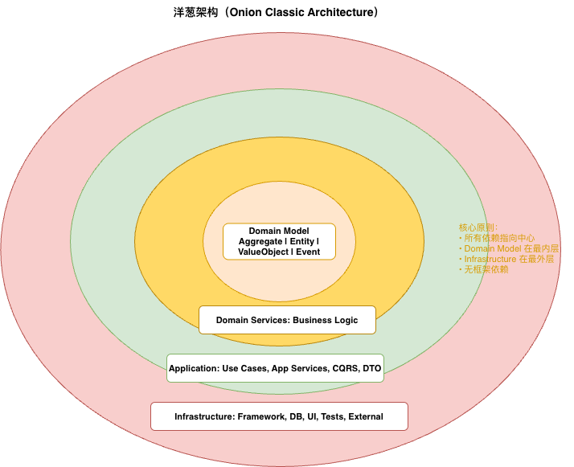

# 架构风格指南

JFoundry 通过 jMolecules 表达两类主架构风格：Hexagonal 和 Onion。它们都是纯 Java 注解模块，不依赖 Spring、Helidon 或 Quarkus。JFoundry 框架内部默认采用 Onion simplified；对外仍同时提供 Hexagonal 与 Onion 门面，业务项目按自己的架构偏好选择。

JFoundry 不再包装 Layered Architecture。Layered、Hexagonal 和 Onion 在企业应用里经常表达同一组角色的不同投影；把它们叠加使用容易让新用户误以为需要同时维护多套架构词汇。若项目确实要使用 Layered，请直接依赖 `org.jmolecules:jmolecules-layered-architecture` 和 jMolecules ArchUnit 原生规则。

## 模块选择

| 模块 | 适用场景 |
|------|----------|
| `jfoundry-hexagonal` | 使用端口和适配器隔离应用核心与外部技术 |
| `jfoundry-onion` | 使用 Onion 环形依赖保护领域模型 |

`jfoundry-architecture` 是架构风格聚合 POM，不作为业务代码的直接运行时依赖。业务项目按需依赖具体模块。

## 选择原则

Hexagonal 和 Onion 都定义“应用核心如何与外部世界隔离”的主架构风格，正常项目应选择其中一种，不要在同一个 ArchUnit 分析范围内混用。JFoundry 自身为了降低内部模块语义混乱，内部实现默认采用 Onion simplified；但这不改变业务项目可以选择 Hexagonal 或 Onion 的事实。

Hexagonal 角色语义：

| 注解 | 含义 | 常见位置 | 示例 |
|------|------|----------|------|
| `@Application` | 六边形内部的应用核心，不只表示 application service 包；领域模型和应用服务都属于这个核心 | `domain`、`application`，或更细的应用核心包 | 聚合、领域服务、应用服务、用例编排 |
| `@PrimaryPort` | 应用核心暴露给外部驱动方的入口 | `application.port.in`、`application.usecase` | `CreateOrderUseCase`、`CancelOrderCommandHandler` |
| `@PrimaryAdapter` | 驱动应用的技术入口 | `adapter.in.web`、`adapter.in.messaging`、`adapter.in.scheduler` | REST Controller、消息监听器、定时任务、CLI |
| `@SecondaryPort` | 应用核心对外部能力的出站需求 | 普通端口位于 `application.port.out`；聚合 Repository 可保留在 `domain.repository` | `OrderRepository`、`PaymentGatewayPort`、`OrderEventPublisherPort` |
| `@SecondaryAdapter` | 外部能力的具体实现 | `adapter.out.persistence`、`adapter.out.messaging`、`adapter.out.client` | MyBatis adapter、Kafka sender、支付 SDK adapter |

JFoundry 不提供裸 `@Port` / `@Adapter` 包装注解；如果方向明确，就使用 Primary 或 Secondary 特化注解。如果项目确实需要模糊角色，请直接使用 jMolecules 原生 `@Port` / `@Adapter`。Spring Boot auto-configuration 只负责装配 adapter，不标注为 adapter。

聚合 Repository 首先是 DDD Repository 契约。在 Hexagonal 项目中，它可以同时标注为 `@SecondaryPort`，但仍保留在 `domain.repository`，不需要在应用层 `port.out` 再复制一份接口。`@SecondaryAdapter` 可以实现普通 Secondary Port，也可以实现这种 DDD Repository。

Hexagonal Architecture 本身不规定固定包结构。小型项目可以使用全局的
`application.port.in` 和 `application.port.out`；对于非简单业务项目，JFoundry 推荐先按
业务能力组织，再在能力内部表达方向，例如 `application.claim.query.port.in`、
`application.claim.query.port.out` 和 `application.claim.query.view`。严格约定规则能够识别
任意层级的方向包。

Primary Port 和 Secondary Port 可以共同使用应用层拥有的查询或视图模型，但不应让任一方向
拥有另一方向要暴露的模型。共享模型应放在中立的 application capability 包：Primary Port
不得依赖 `port.out` 包，Secondary Port 不得依赖 `port.in` 包。HTTP DTO 保留在 Primary
Adapter，持久化或远程系统数据模型保留在 Secondary Adapter。

当 CQRS 由事件或状态变化构建、刷新派生读模型时，该投影物化契约可以是 Secondary Port，技术实现可以是 Secondary Adapter。它与只读查询契约不同：`Reader` 读取该模型，`ProjectionStore` 则根据已由命令或事件决定的事实物化或更新派生读模型，不重新决定业务规则，也不修改聚合。按技术职责分包有助于定位时，可将 Reader 放在 `adapter.out.query.<feature>`，将物化实现放在 `adapter.out.projection.<feature>`。`projection` 是可选术语，不是通用包名或后缀，也不意味着必须使用 Event Sourcing。



Onion 角色语义：

| 风格 | 注解 | 含义 | 常见位置 | 示例 |
|------|------|------|----------|------|
| Onion Simple | `@DomainRing` | 领域核心，承载业务概念和不变量 | `domain` | 聚合、实体、值对象、领域事件、领域服务、仓储契约 |
| Onion Simple | `@ApplicationRing` | 应用层，编排用例并协调领域模型和应用所需的依赖契约 | `application` | 应用服务、命令处理、查询入口、事务边界附近的流程编排 |
| Onion Simple | `@InfrastructureRing` | 外圈基础设施，依赖内圈并实现技术细节 | `infrastructure`、`adapter` | 持久化实现、消息实现、外部 API client、运行时配置 |
| Onion Classical | `@DomainModelRing` | 更细分的领域模型核心 | `domain.model` | 聚合、实体、值对象、领域事件 |
| Onion Classical | `@DomainServiceRing` | 领域服务环 | `domain.service` | 跨聚合且属于领域语义的服务 |
| Onion Classical | `@ApplicationServiceRing` | 应用服务环 | `application` | 用例服务、命令处理、应用流程编排 |
| Onion Classical | `@InfrastructureRing` | 基础设施环 | `infrastructure` | 数据库、消息、外部系统、框架配置 |

普通新项目如果选择 Onion，优先使用 Onion Simple；只有团队明确需要区分 domain model、domain service、application service 等更细 ring 语义时，再使用 Onion Classical。无论 Simple 还是 Classical，依赖方向都应指向领域核心，Spring Boot auto-configuration 仍只负责装配，不作为 Onion ring 参与建模。

在 Onion 中，同一个聚合 Repository 是内环定义的 DDD 契约，由 `@InfrastructureRing` 类型实现。这是 Onion 对依赖倒置的表达；不要为了表达同一关系而在 Onion 分析范围内混入 Hexagonal 注解。

Onion Architecture 没有 Primary/Secondary Port 或 Adapter 角色体系，也没有规定 `*Port`、
`*Adapter`、`*UseCase` 类名后缀。领域类型应优先使用通用语言，应用层契约应按实际职责命名。
`Reader`、`Store`、`Finder`、`Provider` 等名称可以是清晰的 Java 项目约定，但它们不是 DDD
或 Onion 的官方模式，JFoundry 也不强制使用。基础设施实现可以在确有辨识价值时增加
`Mybatis`、`Kafka` 等技术名称。

在 Onion 的同一个 Ring 内，非简单代码仍可优先按业务能力组织。多个应用层契约共享的模型
归中立的 application capability 包所有，不应仅为了复用而移入 domain，也不应由
infrastructure 定义后让 application 反向依赖。这条所有权原则不会给 Onion 引入
`port.in` / `port.out` 方向语义。

当 CQRS 根据已由命令或事件决定的事实物化或更新派生读模型时，内环拥有所需契约，`@InfrastructureRing` 类型实现它；它不重新决定业务规则，也不修改聚合。这不会让 Onion 获得 Hexagonal 的 Port 或 Adapter 角色。该物化组件应与只读 `Reader` 分开；按技术职责分包有助于定位时，基础设施可以将 Reader 放在 `query.<feature>`，将物化实现放在 `projection.<feature>`。这是可选项目术语，不要求 Event Sourcing。



JFoundry 框架内部直接使用 jMolecules 原生架构注解，`jfoundry-hexagonal` 与 `jfoundry-onion` 保留为业务项目使用的稳定门面。`JFoundryRules` 会同时识别 JFoundry 包装注解和 jMolecules 原生注解。

### 如何选择？

| 视角 | 更适合的场景 | 简单例子 |
|------|----------------|----------|
| Hexagonal | 外部输入/输出边界清晰，需要明确区分“谁驱动应用”和“应用依赖哪些外部能力” | 订单系统通过 REST 接收命令，通过数据库保存聚合，通过 Kafka 投递事件，通过支付 SDK 调外部服务 |
| Hexagonal | 正在从 Controller → Service → Mapper 迁移，希望逐步拆出 primary port、secondary port 和 adapter | Controller 调 primary port，应用服务调 secondary port，MyBatis adapter 实现 secondary port |
| Hexagonal | 领域事件需要可靠外部化，Outbox、MessageSender、broker sender 都要作为外部能力处理 | 订单创建后写 Outbox，再由 Kafka `MessageSender` 投递 |
| Onion | 更关心依赖向领域核心收敛，不需要显式区分 primary / secondary 端口 | 定价、计费、审批规则库主要维护聚合、值对象和领域服务，外部集成较少 |
| Onion | 既有项目已经按 domain / application / infrastructure 分包，并且依赖方向基本向内 | 老系统保留 Onion 包结构，只补充 jfoundry 注解和 ArchUnit 规则 |
| Onion Classical | 团队明确需要区分 domain model、domain service、application service、infrastructure 等更细 ring | 复杂领域平台已有成熟的 Onion Classical 术语和包结构 |
| 不强制选择完整架构风格 | 简单 CRUD 后台、短期原型、没有明显业务不变量或外部端口 | 管理台只维护少量表单和列表，可先使用更简单的 Spring Boot 分层 |

快速判断：

```text
需要清楚表达外部输入/输出边界 -> Hexagonal
主要想保护领域核心、团队习惯环形依赖语言 -> Onion
只是简单 CRUD 或短期原型 -> 先不要引入完整架构风格
```

## 启用规则

新业务项目选择 Hexagonal 时，推荐启用严格入口：

```java
@AnalyzeClasses(packages = "com.mycompany.myapp")
class ArchitectureTest {

    @ArchTest
    ArchTests rules = JFoundryRules.hexagonalStrict();
}
```

如果业务项目选择 Onion Simple，则改用：

```java
@AnalyzeClasses(packages = "com.mycompany.myapp")
class ArchitectureTest {

    @ArchTest
    ArchTests rules = JFoundryRules.onionSimple();
}
```

`JFoundryRules.onionSimple()` 和 `JFoundryRules.onionClassical()` 分别给出基础守护规则 + 单一主架构风格入口，并附带 Hexagonal/Onion 互斥规则。`JFoundryRules.hexagonalStrict()` 是 Hexagonal 项目的推荐入口：它包含 `JFoundryRules.hexagonal()` 的基础 Hexagonal 依赖规则，也包含 JFoundry 对端口、适配器、包名和持久化细节隔离的推荐落地约定。每个主架构入口还会在分析范围内完全没有对应架构注解时直接失败，避免注解驱动规则以空集形式产生假通过；这个守卫只要求所选风格至少被声明一次，不要求局部分析范围必须同时出现所有角色或 Ring。若只需要 jMolecules 原生 Hexagonal 规则，可单独使用 `JFoundryRules.hexagonal()`。

## 权威参考

- jMolecules Architecture：<https://github.com/xmolecules/jmolecules/tree/main/jmolecules-architecture>
- jMolecules ArchUnit：<https://github.com/xmolecules/jmolecules-integrations/tree/main/jmolecules-archunit>
- Hexagonal Architecture / Ports and Adapters：<https://alistair.cockburn.us/hexagonal-architecture/>
- Onion Architecture：<https://jeffreypalermo.com/2008/07/the-onion-architecture-part-1/>
